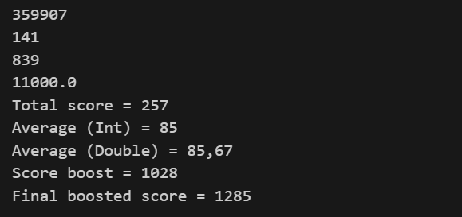

# Kotlin Lab 1 — Opérations de base et variables

## 📌 Description

Ce programme Kotlin démontre des concepts fondamentaux de programmation, notamment :

* Les opérations arithmétiques
* La priorité des opérateurs
* L'utilisation des variables et constantes
* La différence entre les calculs `Int` et `Double`
* Le formatage de texte
* Des calculs simples de scores

Ce laboratoire est destiné aux débutants qui apprennent les bases de Kotlin.

---

## 🚀 Aperçu du programme

Le programme est divisé en trois tâches principales :

### ✅ Tâche 1 — Opérations sur les nombres

Effectue plusieurs calculs arithmétiques pour démontrer :

* Les opérations mathématiques
* La priorité des opérateurs
* L'utilisation des parenthèses

Exemples :

* Multiplications et additions complexes
* Division avec nombres à virgule flottante

---

### ✅ Tâche 2 — Opérations sur les variables

Définit trois scores de niveaux :

* `scoreLevel1`
* `scoreLevel2`
* `scoreLevel3`

Calcule :

* Le score total
* La moyenne avec division entière (`Int`)
* La moyenne avec précision décimale (`Double`)

Montre la différence entre :

* Division entière
* Division en nombres réels

---

### ✅ Tâche 3 — Bonus

Ajoute un système de bonus :

* Applique un multiplicateur au score total
* Calcule un score final amélioré

---

## 🧮 Exemple de sortie

